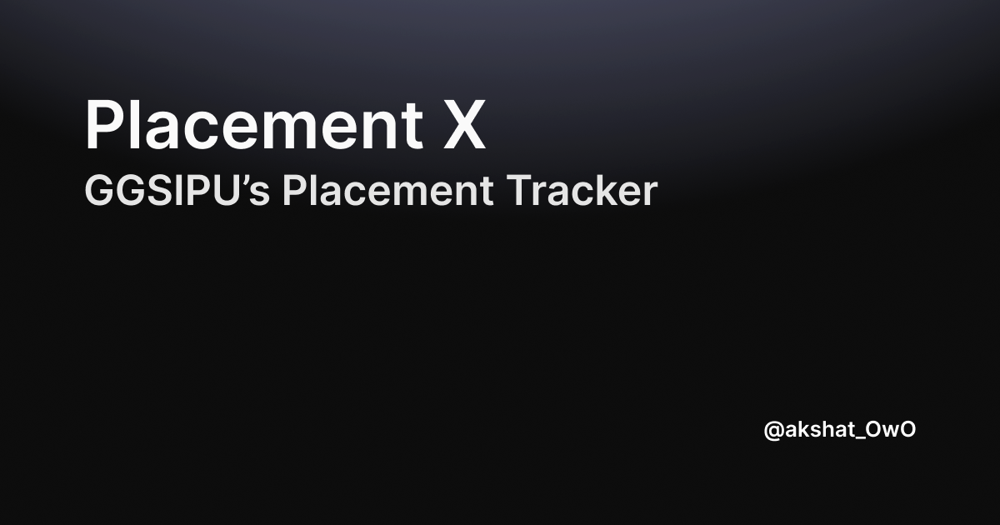

# PlacementX



A platform tracking placement statistics for GGSIPU's 2021-25 batch. Built with Astro, Sanity and Tailwind CSS.

## 🚀 Quick Start

```bash
# Clone the repository
git clone https://github.com/akshat-OwO/placementx.git

# Install dependencies
npm install

# Start development server
npm run dev
```

## 🛠 Tech Stack

- [Astro](https://astro.build)
- [Tailwind CSS](https://tailwindcss.com)
- [Sanity.io](https://www.sanity.io)

## 📱 Development

```bash
npm run dev        # Start development server
npm run build      # Build for production
npm run preview    # Preview production build
```

## 📫 Contact

For queries, reach out at [@akshat_OwO](https://x.com/akshat_OwO)
